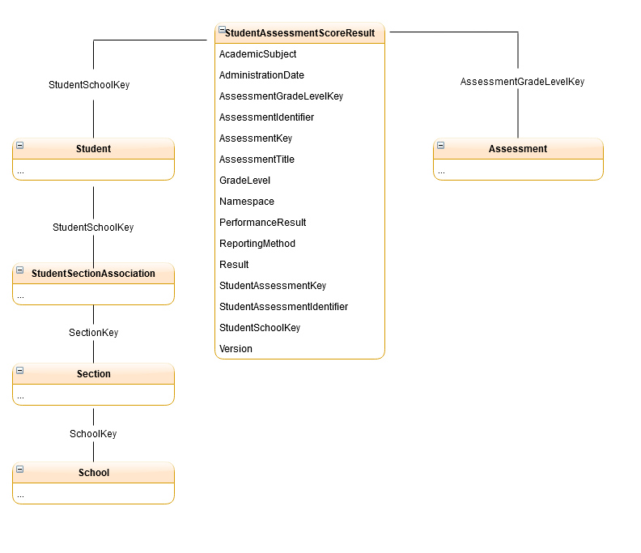

# Assessment Collection

## Functional vision

Are students improving in *[content area e.g. reading, math, science]* over time
*[timeframe e.g. within a school year, over three years, over last year]*?

To determine, by presenting interoperable multiple measures assessment data in
one user interface, if remediation, student assistance/intervention or
enrichment is needed (or to reevaluate after interventions have been provided)
by school staff such as school counselors, instructional coaches, school
administrators, and potentially classroom teachers

## Views in this Collection

> The draw.io diagram this image was generated from can be found
[here](diagrams/StudentAssessmentScoreResult.drawio)

 * [Assessment](Assessment.md)
 * [StudentAssessmentScoreResult](StudentAssessmentScoreResult.md)

## Installation

Install the needed views by running the
[Assessments-Script.sql](https://github.com/Ed-Fi-Alliance-OSS/Ed-Fi-Starter-Kit-Assessments/blob/main/AssessmentModels/Assessments%20Script.sql)
script on the ODS that contains the assessment data you wish to report on.